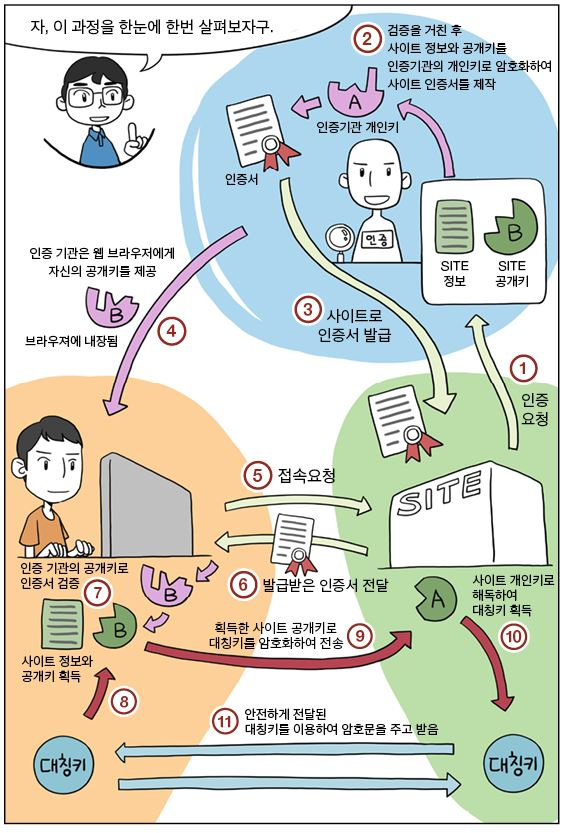

# 암호화 방식
## 대칭키 
- 암호화,복호화에 사용되는 키가 동일하다.
- 기밀성O, 무결성/인증/부인방지 보장x
    - 장점: 속도가 빠르다. 즉 대용량 데이터 암호화에 적합하다.
    - 단점 : 키를 교환해야 한다. 키를 교환하는 중간에서 탈취할 가능성이 있다. 보안에 약하다.
    - SEED,DES,3DES,AES,AARIA,ChaCha20

## 공개키(비대칭키)
- 암호화,복호화에 사용되는 키가 서로 다르다.
- 기밀성/인증/부인방지 기능 제공
    - 장점 : 키 분배가 필요없다. 보안성이 좋다.
    - 단점 : 속도가 느리다.
    - RSA,DSA,ECC

# SSL 통신 과정
  
< 출처 :  https://vitalholic.tistory.com/368 & https://minix.tistory.com/397  >  
1. 클라이언트(브라우저)에서 서버로 인증을 요청하면, 인증기관에서는 서버의 공개키A'를 자신의 비밀키F로 암호화 한 인증서와 공개키 A'를 클라이언트에게 보낸다. 
2. 클라이언트는 브라우저에 내장된 인증기관의 공개키F'를 사용하여 인증서를 검증한다.
3. 인증이 완료되면, 공개키A'를 획득하고 이 공개키A'로 대칭키를 암호화하여 서버에 전송한다.
4. 서버는 자신의 개인키A로 복호화하여 대칭키를 얻는다. 
5. 이후에는 대칭키로 브라우저와 서버사이에서 안전하게 통신할 수 있다.

즉 SSL 통신 과정에서는 대칭키와 비대칭키를 모두 사용하여 속도는 빠르고 안전한 통신을 할 수 있게 된다.