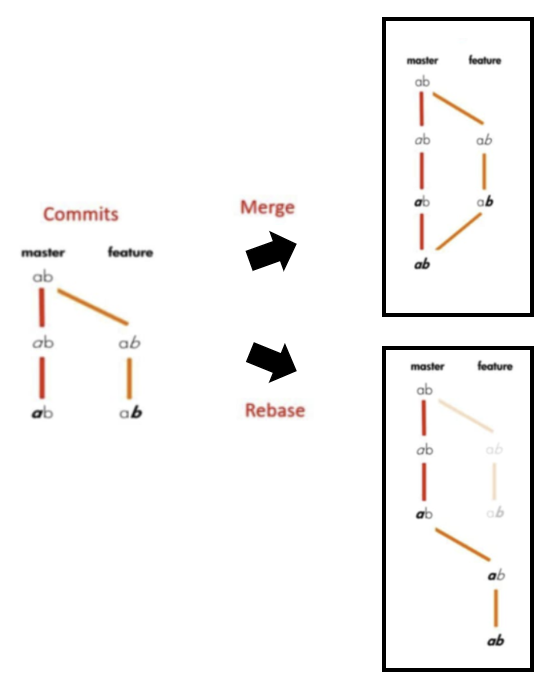

- Git에서 한 브랜치에서 다른 브랜치로 합치는 방법에는 **merge**와 **rebase**가 있다.  
merbe는 브랜치를 통합하는 것이고, rebase는 branch의 base를 옮기는 것이다.  
두 방식의 최종 결과물은 같다.

### merge
``` bash
$git checkout master
$git merge [master에 병합할 브랜치명]

# or

$ git merge [master에 병합할 브랜치명] master
```
- 커밋 순서가 변경되지 않고, 기존 분기는 유지된다.
- 병합을 하면 합쳐진 브랜치에 커밋 메시지가 중복으로 쌓인다.

### rebase
``` bash
$git checkout [rebase할 브랜치]
$git rebase master
$git checkout master
$git merge [rebase할 브랜치]
```
- 병합을 하면 브랜치의 커밋 메시지가 시간순서대로 합쳐진다.
- git rebase master를 하면 rebase할 브랜치의 변경 사항을 patch에 저장해둔다.  
이후 master로 checkout한 뒤 patch에 저장된 변경사항을 시간 순서대로 master에 커밋을 생성한다. merge하면 master와 다른 브랜치가 깔끔하게 합쳐진다.
- base의 위치를 변경해서 다른 branch에 commit한 내역을 보고 그대로 끌어오는 방식이다. 중복 로그를 남기지 않고, merge log를 줄일 수 있어서 히스토리를 깔끔하게 유지하기 위해 사용한다.
- rebase는 히스토리를 지우므로, 데이터의 유실이 일어날 수도 있다.


